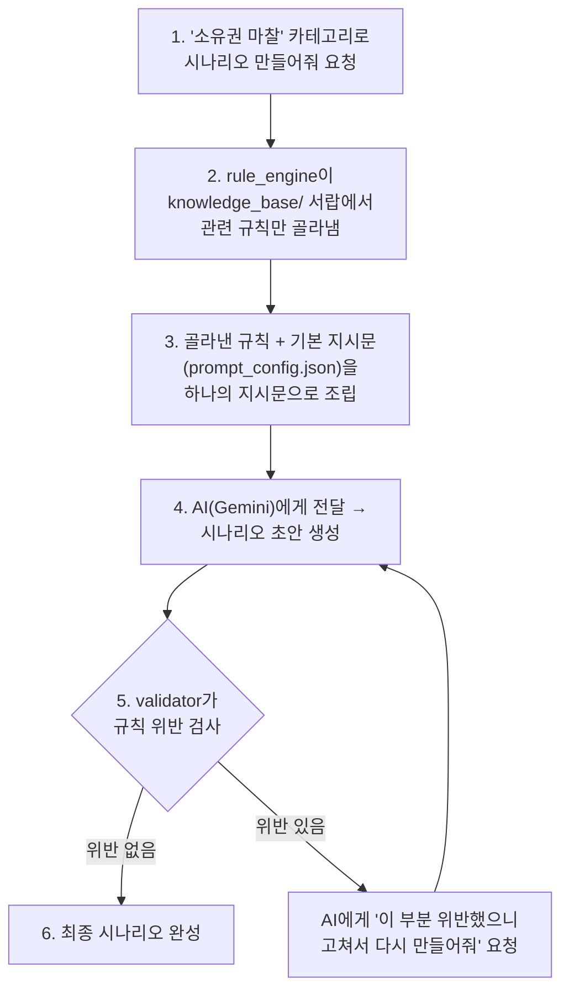

# 시나리오 생성 규칙 엔진 - 비개발자용 사용 가이드

> 개발 지식이 없어도 "이게 뭘 하는 물건이고, 어떻게 실행하는지" 이해할 수 있도록 쓴 문서입니다.
> 코드 세부 구현이 궁금하면 [RULE_ENGINE_README.md](RULE_ENGINE_README.md)(개발자용)를 참고하세요.

---

## 1. 이게 뭐 하는 물건인가요?

한 문장으로: **"아이들이 겪는 또래 갈등 상황(장난감 뺏기, 놀림 등)을 AI가 자동으로 만들어내는데, 그 전에 법·정부 요구사항·윤리·아동발달 전문가 기준을 먼저 확인시키고, 만들어진 결과도 다시 검사하는 시스템"**입니다.

비유로 설명하면:

- `knowledge_base/` 폴더 = **"이 콘텐츠를 만들 때 지켜야 할 규칙을 적어둔 서랍장"**. 서랍마다 라벨(⚖️법적/🏛️정부/🧭윤리/👶발달지침)이 붙어 있고, 각 서랍 안에는 규칙과 "이 규칙이 왜 있는지(출처)"가 적힌 종이(마크다운 파일)가 들어 있습니다.
- `rule_engine/` 폴더 = **"서랍장에서 필요한 규칙 종이를 꺼내서, AI에게 줄 지시문에 붙여넣고, AI가 만든 결과물이 규칙을 어겼는지 다시 확인하는 직원"**.
- `prompts/prompt_config.json` = **"AI에게 항상 기본적으로 전달하는 역할 설명서"** (예: "너는 아동 교육 전문가야, 이런 형식으로 답해줘").

기획자나 상담 전문가는 **`knowledge_base/` 폴더의 문서만 고치면** AI가 만드는 시나리오의 규칙이 바뀝니다. 코드를 몰라도 됩니다.

---

## 2. 전체 폴더 구조 한눈에 보기

```
Communication_simulator/
│
├─ knowledge_base/              👉 "규칙 서랍장" (여기만 수정해도 됨)
│  ├─ rules_index.json          - 모든 규칙의 목록표 (규칙 추가 시 여기에도 한 줄 등록)
│  ├─ legal/                    ⚖️  법적 규제 (아동복지법, 학교폭력예방법, 개인정보보호법)
│  ├─ government/                🏛️  정부 과제/사업 요구사항 (해커톤·정부지원사업 공고문 등)
│  ├─ ethics/                     🧭  윤리/도덕성 기준 (AI 윤리기준, 내부 편집 기준)
│  └─ guideline/                  👶  아동발달/상담 지침 (난이도, '장난 vs 폭력' 판단 기준)
│
├─ prompts/
│  └─ prompt_config.json         👉 AI에게 줄 기본 지시문 + 결과 형식 정의
│
├─ rule_engine/                  👉 "규칙을 꺼내서 조립하고 검사하는 프로그램" (개발자 영역)
│  ├─ rule_loader.py             - knowledge_base 문서를 읽어들임
│  ├─ retriever.py                - 지금 만들 시나리오에 맞는 규칙만 골라냄
│  ├─ rule_engine.py               - 골라낸 규칙을 라벨 붙여서 AI 지시문으로 조립
│  ├─ validator.py                  - AI가 만든 결과물이 규칙을 어겼는지 재검사
│  └─ scenario_generator.py          - 위 과정을 실제로 실행해서 시나리오를 완성함
│
├─ examples/                      👉 실제로 실행해볼 수 있는 예시 파일
│  ├─ inspect_rules_example.py    - (AI 호출 없이) 규칙만 확인해보는 예시
│  └─ generate_scenario_example.py - (AI 호출 있음) 실제 시나리오 생성 예시
│
├─ webapp/                        👉 브라우저(웹페이지)로 실행해보는 화면
│  ├─ main.py                     - 규칙 엔진을 웹에서 호출할 수 있게 감싸는 서버
│  └─ static/index.html            - 카테고리 선택 → 생성 버튼 → 결과 확인 화면
│
├─ requirements.txt               👉 실행에 필요한 프로그램 목록
└─ RULE_ENGINE_README.md          👉 개발자용 상세 설명
```

---

## 3. 동작 흐름 (요청 → 결과까지 무슨 일이 일어나나)



글로 풀면:

1. "장난감 뺏기 같은 소유권 마찰 시나리오 2개 만들어줘"라고 요청합니다.
2. 프로그램이 `knowledge_base/` 서랍장에서 **이 요청에 관련된 규칙만** 골라냅니다. (예: 아동복지법 금지행위, 학교폭력법 정의, AI 윤리기준 등 — 관련 없는 규칙은 자동으로 제외)
3. 골라낸 규칙에 라벨(⚖️/🏛️/🧭/👶)과 출처를 붙여서, AI에게 보낼 지시문 안에 끼워 넣습니다.
4. 이 지시문을 AI(Google Gemini)에게 보내 시나리오 초안을 받습니다.
5. 받은 결과를 다시 한번 규칙 위반 여부로 검사합니다 (예: 금지 단어가 들어갔는지, 필요한 항목이 다 채워졌는지).
6. 문제가 없으면 최종 결과로 확정하고, 문제가 있으면 AI에게 "이 부분을 고쳐서 다시 만들어줘"라고 재요청합니다.

---

## 4. 실제로 실행해보기 (Windows 기준)

### 4-1. 사전 준비물

- Python이 컴퓨터에 설치되어 있어야 합니다. (이미 설치되어 있다면 이 단계는 넘어가도 됩니다)
- (실제 AI 호출까지 해보려면) Google(Gemini) 계정의 API 키가 필요합니다. 규칙만 확인하는 것은 API 키 없이도 가능합니다.

### 4-2. 필요한 프로그램 설치

PowerShell(또는 명령 프롬프트)을 열고, 프로젝트 폴더로 이동한 뒤 아래 명령을 입력합니다.

```PowerShell
cd c:\Communication_simulator
pip install -r requirements.txt
```

### 4-3. (1단계) API 키 없이 - "규칙이 잘 붙는지"만 확인해보기

가장 먼저 이걸 실행해서, 시나리오 카테고리별로 어떤 규칙이 자동으로 붙는지 눈으로 확인하는 걸 추천합니다.

```powershell
python examples\inspect_rules_example.py
```

실행하면 화면에 `===== 카테고리: ownership_turn =====` 같은 제목과 함께, 그 상황에 적용되는 규칙 목록(⚖️/🏛️/🧭/👶 라벨 포함)이 출력됩니다. **이 출력이 바로 AI에게 실제로 전달되는 지시문의 핵심 내용**입니다.

### 4-4. (2단계) API 키를 설정하고 - 실제 시나리오 생성해보기

Google(Gemini) API 키를 환경변수로 등록합니다. 이 프로젝트에서는 **한 번만 등록하면 컴퓨터를 재부팅해도 계속 유지되는 방식**(Windows 사용자 환경변수)으로 이미 설정해 두었습니다 — 정확히 어디에, 어떻게 저장됐는지는 바로 아래 **4-6절**에서 설명합니다.

만약 다른 컴퓨터에서 처음 설정하는 경우라면 PowerShell에서 아래처럼 등록하면 됩니다.

```powershell
setx GEMINI_API_KEY "여기에 본인의 Gemini API 키"
```

`setx`로 등록한 뒤에는 **새 PowerShell 창을 열어야** 반영됩니다 (지금 열려있는 창에는 즉시 적용되지 않음).

그 다음 실행합니다.

```powershell
python examples\generate_scenario_example.py
```

몇 초 후, 실제로 AI가 만든 시나리오 결과(제목, 상황 설명, 학습 목표 등)가 JSON 형태로 화면에 출력됩니다. 만약 규칙을 위반한 부분이 있었다면 "--- 검증 실패 ---"라는 문구와 함께 어떤 규칙을 위반했는지도 함께 출력됩니다.

### 4-5. 결과가 이상해 보인다면

- API 키를 안 넣었거나 잘못 넣으면 오류가 나며 멈춥니다 → 4-6절에서 키가 제대로 저장되어 있는지 확인하세요.
- `pip install` 단계에서 오류가 나면, 회사/학교 네트워크 방화벽 문제일 수 있습니다 → 개발 담당자에게 문의하세요.
- "인증 실패(401/403)" 같은 오류가 나면, 키 자체가 잘못됐거나 만료된 것일 수 있습니다 → [Google AI Studio](https://aistudio.google.com/apikey)에서 키를 다시 확인/발급하세요. Gemini API 키는 보통 `AIzaSy`로 시작하는 형태입니다.

### 4-6. API 키는 어디에 저장되나요?

**결론부터: 이 프로젝트 코드나 폴더 안에는 API 키가 저장되어 있지 않습니다.** 아래처럼 "컴퓨터(Windows 계정) 전역"에 저장되어 있고, 코드는 실행되는 순간 그 값을 잠깐 읽어올 뿐입니다.

| 항목                           | 내용                                                                                                                                                                                                   |
| ------------------------------ | ------------------------------------------------------------------------------------------------------------------------------------------------------------------------------------------------------ |
| **저장 위치**            | Windows 사용자 환경변수 (`GEMINI_API_KEY`라는 이름으로 저장). 실제로는 레지스트리의 `HKEY_CURRENT_USER\Environment` 라는 곳에 기록됩니다.                                                          |
| **저장 방법**            | `setx GEMINI_API_KEY "..."` 명령으로 등록. 이 방식은 **이 컴퓨터의 현재 Windows 로그인 계정에만** 영구적으로 저장되며, 다른 컴퓨터나 다른 계정으로 옮기면 다시 등록해야 합니다.                |
| **프로젝트 파일에는?**   | 없습니다.`rule_engine/scenario_generator.py` 코드는 실행 시점에 `os.environ["GEMINI_API_KEY"]`로 그 값을 "읽기"만 하고, 어떤 `.py`/`.json`/`.md` 파일에도 키를 저장하거나 적어두지 않습니다. |
| **깃허브에 올라가나요?** | 아니요. 애초에 파일에 없으므로 커밋되지 않습니다. 혹시 나중에`.env` 파일 같은 걸 만들어 키를 넣더라도, `.gitignore`에 `.env`가 이미 등록되어 있어 git이 무시합니다.                              |

**직접 확인해보는 방법:**

```powershell
# 새 PowerShell 창에서 (설정 직후의 창에서는 안 보일 수 있음)
$env:GEMINI_API_KEY
```

값이 화면에 출력되면 정상 등록된 것입니다. GUI로 보고 싶다면: `Windows 키` → "환경 변수 편집" 검색 → **사용자 변수** 목록에서 `GEMINI_API_KEY` 확인.

**키를 바꾸거나 지우고 싶을 때:**

```powershell
setx GEMINI_API_KEY "새로운 키 값"      # 덮어쓰기 (새 창부터 적용)
[System.Environment]::SetEnvironmentVariable('GEMINI_API_KEY', $null, 'User')  # 완전히 삭제
```

⚠️ **보안 주의사항**

- 이 환경변수는 **같은 Windows 계정으로 로그인한 사람이라면 누구나** (`$env:GEMINI_API_KEY` 명령 한 줄로) 볼 수 있습니다. 개인 PC가 아니라면 주의하세요.
- API 키를 대화창이나 메신저 등 텍스트로 주고받으면 대화 기록에 그대로 남을 수 있습니다. 이미 다른 곳에 키를 붙여넣은 적이 있다면, [Google AI Studio](https://aistudio.google.com/apikey)에서 해당 키를 삭제하고 새로 발급받는 것을 권장합니다.

---

## 5. 웹페이지에서 실행해보기

지금까지는 검은 화면(터미널)에 결과가 텍스트로 출력됐는데, 이 프로젝트에는 **브라우저에서 마우스 클릭만으로** 시나리오를 생성해볼 수 있는 간단한 웹페이지도 포함되어 있습니다.

### 5-1. 지금 당장 열어보기

**이미 웹 서버가 실행 중입니다.** 브라우저를 열고 아래 주소로 접속하면 바로 사용할 수 있습니다.

```
http://127.0.0.1:8000
```

화면에서 카테고리(소유권 마찰/신체 경계/언어적 불편함/규칙 위반)와 개수, 연령대를 고른 뒤 **"시나리오 생성하기"** 버튼을 누르면 몇 초 후 결과가 카드 형태로 나타납니다. **"이 카테고리에 적용되는 규칙 보기"** 버튼을 누르면 그 시나리오를 만들 때 실제로 AI에게 전달된 규칙 목록(⚖️/🏛️/🧭/👶)도 확인할 수 있습니다.

### 5-2. 나중에 다시 실행하는 방법

컴퓨터를 재부팅했거나 서버가 꺼져 있다면, PowerShell에서 아래 명령으로 다시 켤 수 있습니다.

```powershell
cd c:\Communication_simulator
uvicorn webapp.main:app --reload
```

터미널에 `Uvicorn running on http://127.0.0.1:8000` 같은 문구가 나오면 정상 실행된 것이며, 이 창을 닫지 않고 그대로 켜둔 채로 브라우저에서 `http://127.0.0.1:8000`에 접속하면 됩니다. 서버를 끄려면 그 터미널 창에서 `Ctrl + C`를 누르면 됩니다.

> 이 웹페이지는 **내 컴퓨터 안에서만** 열리는 로컬 서버입니다(`127.0.0.1` = 내 컴퓨터 자신을 가리키는 주소). 인터넷의 다른 사람이 접속할 수 있는 주소가 아니므로, 데모/개발 목적으로는 안전하게 사용할 수 있습니다.

---

## 6. 규칙을 수정하거나 추가하고 싶을 때 (코드 몰라도 가능)

예를 들어 "새로운 정부 요구사항이 생겼다" 또는 "이 표현은 금지해야 한다"는 판단이 들면:

1. 해당하는 서랍(`knowledge_base/legal/`, `government/`, `ethics/`, `guideline/` 중 하나)에 있는 `.md` 파일을 열어서 규칙 문장을 추가/수정합니다. (메모장으로 열어도 됩니다)
2. **새 파일을 아예 새로 만드는 경우에만** `knowledge_base/rules_index.json`이라는 목록표에 그 파일의 정보를 한 줄 추가해야 합니다. (기존 파일 수정만 하는 거라면 이 단계는 필요 없습니다)
3. 저장 후 4-3의 확인 스크립트를 다시 실행해보면, 바뀐 내용이 바로 반영된 것을 확인할 수 있습니다.

⚠️ 아직 채워지지 않은 부분:

- `knowledge_base/government/GOV-001_정부지원사업_요구사항_TEMPLATE.md` → 실제로 참여 중인 정부지원사업/해커톤의 공고문 요구사항을 아직 채우지 않았습니다. 해당 문서를 열어 체크리스트를 채워야 규칙에 반영됩니다.
- `ethics/ETH-002`, `guideline/GDL-001` 문서는 팀이 만든 초안이며, 아동상담 전문가 검토 후 확정하는 것을 권장합니다 (문서 안에 표시되어 있습니다).

---

## 7. 자주 묻는 질문

**Q. 이 시스템이 완전히 안전을 보장하나요?**
A. 아니요. 규칙을 지시문에 넣고(3단계), 결과를 다시 검사(5단계)하는 "이중 확인" 구조지만, AI가 예상치 못한 방식으로 규칙을 어길 가능성은 항상 있습니다. 실제 서비스에 쓰기 전 사람이 표본을 검토하는 절차를 두는 것을 권장합니다.

**Q. 법률 조항이 나중에 바뀌면 어떻게 하나요?**
A. `knowledge_base/legal/` 안의 각 문서 하단에 "검증 필요 사항"이라는 항목이 있고, 국가법령정보센터 링크가 적혀 있습니다. 주기적으로 그 링크에서 최신 조문을 확인하고 문서를 갱신해야 합니다.

**Q. 지금은 어떤 AI를 쓰고 있나요?**
A. Google의 Gemini API를 사용합니다 (기본 모델: `gemini-flash-latest`, 비용 효율적인 등급). `GEMINI_API_KEY` 환경변수만 설정하면 바로 사용할 수 있습니다 (자세한 저장 위치는 4-6절 참고).

**Q. AI 회사를 다른 곳으로 바꿔도 되나요?**
A. 네. `rule_engine/scenario_generator.py` 파일 안의 AI 호출 부분만 바꾸면 되고, 규칙 문서들(`knowledge_base/`)은 그대로 재사용됩니다. (이 부분은 개발자에게 요청하시면 됩니다)

**Q. API 키가 노출되면 어떻게 되나요?**
A. 키를 가진 사람은 내 계정으로 AI를 호출할 수 있어 요금이 청구될 수 있습니다. 키를 잘못된 곳에 붙여넣었다면 즉시 [Google AI Studio](https://aistudio.google.com/apikey)에서 해당 키를 삭제(revoke)하고 새 키를 발급받아 4-4절 방식으로 다시 등록하세요.
